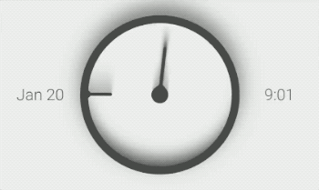
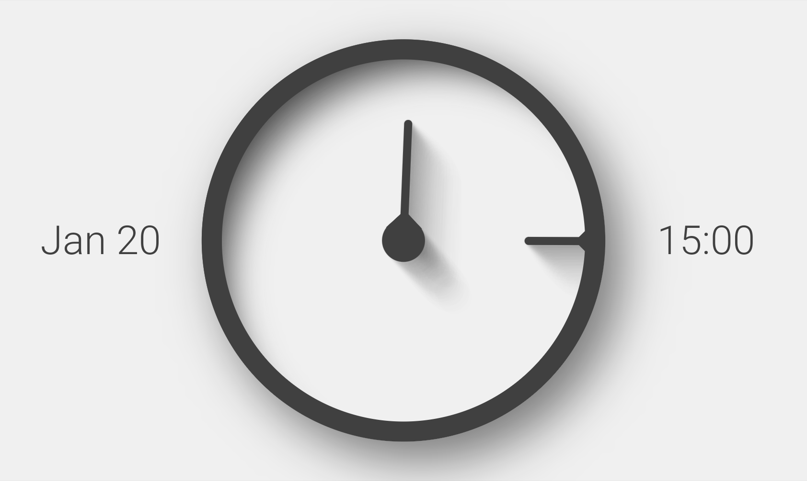
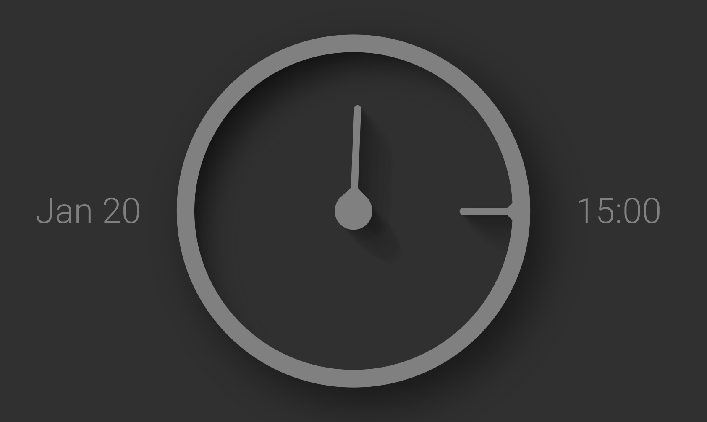

# Dymaxion Clock

This app is a clock face UI developed as an entry for the Flutter Clock Challenge.

It features a simple design which is both analog and digital and makes use of neutral off-white and
off-black grey colors. The analog clock sits between a digitally displayed date and time. Instead of
the hour hand rotating around the center, it rotates around the inside of the border. The second
hand is implemented using skeumorphic shadows which rotate around like a sundial each minute. The
background and foreground colors interpolate between cool and warm variants depending on the
temperature relative to the daily low and high temperatures.

## Features

- Rotating skeumorphic shadows
- Smooth shadow and hand animation
- Temperature dependent colors
- Light and dark mode themes
- Smooth theme changing animation
- 12 or 24 hour format customization

## Screenshots

